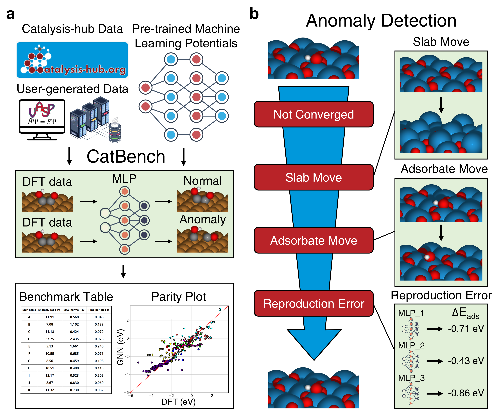
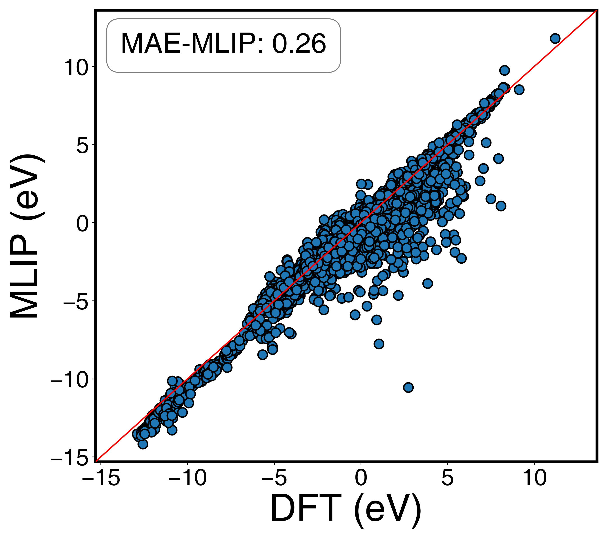
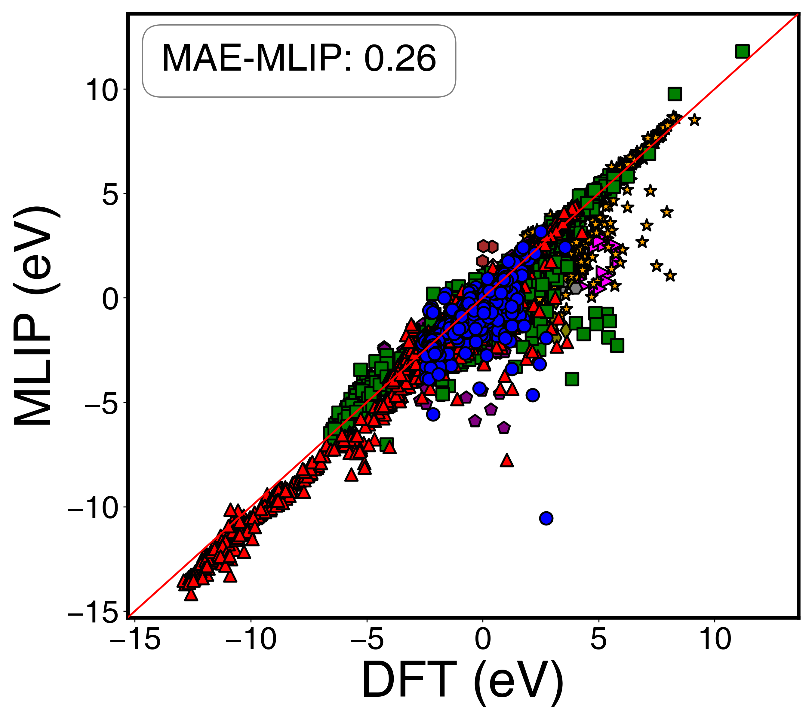
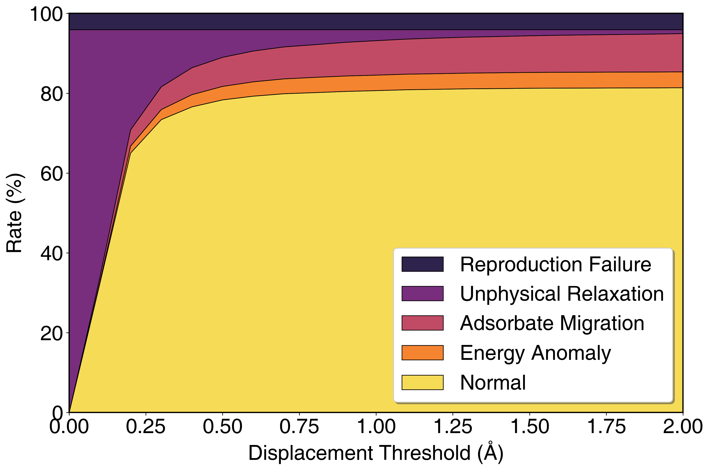
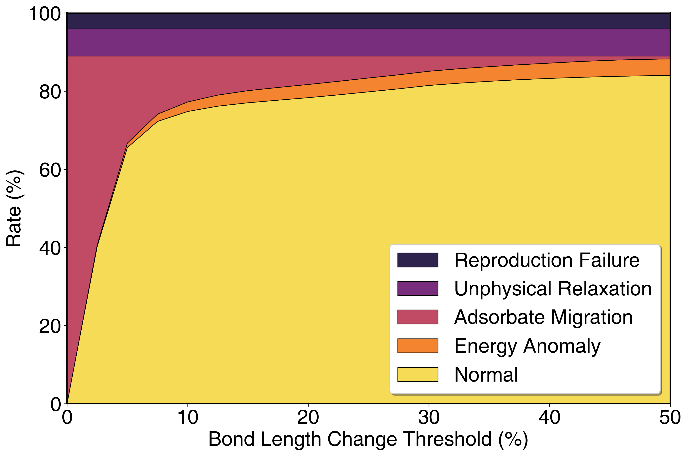
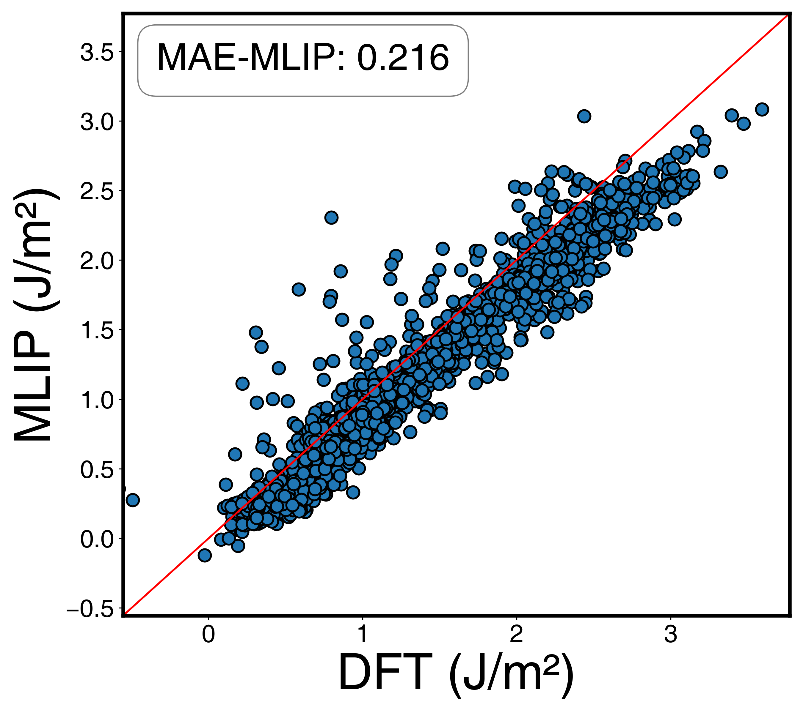
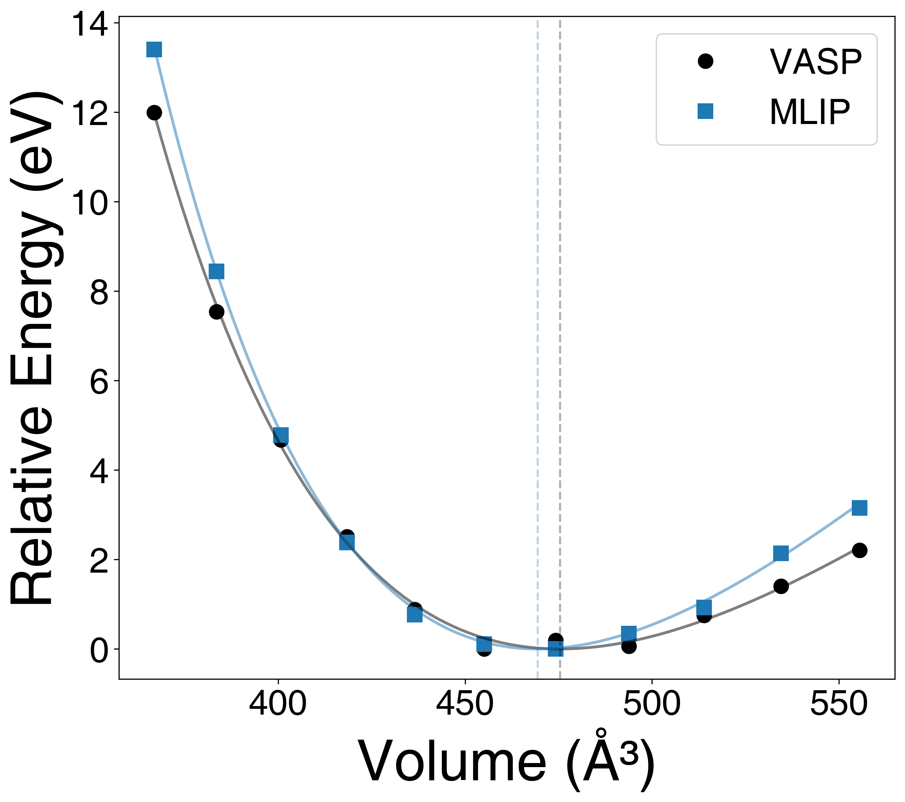

# CatBench


[](https://catbench.org)
[](https://www.python.org/downloads/)
[](https://opensource.org/licenses/MIT)
[](https://github.com/JinukMoon/CatBench)

**CatBench Framework for Benchmarking Machine Learning Interatomic Potentials in Adsorption Energy Predictions for Heterogeneous Catalysis**

CatBench provides a unified framework for evaluating MLIP performance across diverse catalytic systems, offering automated data processing, calculation workflows, and comprehensive analysis tools for adsorption energies, surface energies, bulk formation energies, and equation of state properties.

If you want to use MLIPs in your catalysis research, CatBench enables you to establish quantitative reliability through systematic benchmarking against DFT references.

## Quick Navigation

- [Installation](#installation)
- [Overview](#overview)
- [Adsorption Energy Benchmarking](#adsorption-energy-benchmarking)
- [Relative Energy Benchmarking](#relative-energy-benchmarking)
  - [Surface Energy](#surface-energy)
  - [Bulk Formation Energy](#bulk-formation-energy)
- [Equation of State (EOS) Benchmarking](#equation-of-state-eos-benchmarking)
- [Configuration Options](#configuration-options)
- [Citation](#citation)

## Installation

```bash
# Basic installation (core features only)
pip install catbench

# With D3 dispersion correction support (requires CUDA)
pip install catbench[d3]

# Development installation
git clone https://github.com/JinukMoon/CatBench.git
cd CatBench
pip install -e .

# Development with D3 support
pip install -e .[d3]
```

### Installation Options

- **Basic**: Core benchmarking features without dispersion correction
- **[d3]**: Includes PyTorch for GPU-accelerated D3 dispersion correction

> **Note**: D3 dispersion correction requires CUDA toolkit for GPU acceleration. CPU-only mode is not currently supported.

## Overview



CatBench follows a three-step workflow for comprehensive MLIP evaluation:

1. **Data Processing**: Automated download from CatHub or processing of user VASP calculations
2. **Calculation**: MLIP-based adsorption and reaction energy calculations
3. **Analysis**: Statistical evaluation, anomaly detection, and visualization

## Adsorption Energy Benchmarking

### Data Preparation

#### Option A: Pre-formatted Zenodo Download (Fastest, Recommended)

The five main benchmark datasets used in the CatBench publication are hosted as pre-processed JSON files on Zenodo ([DOI: 10.5281/zenodo.17157086](https://zenodo.org/records/17157086)). No CatHub scraping, no preprocessing — files are downloaded directly into `raw_data/` and are immediately usable:

```python
from catbench.adsorption import zenodo_download, list_zenodo_benchmarks

# See the 5 available benchmark datasets
list_zenodo_benchmarks()
# → ['BM_dataset', 'ComerGeneralized2024', 'FG_dataset', 'KHLOHC_origin', 'MamunHighT2019']

# Download one (MD5-verified automatically)
zenodo_download("MamunHighT2019")
# → raw_data/MamunHighT2019_adsorption.json (195 MB)

# Pass overwrite=True to force redownload; verify=False to skip hash check
```

| Benchmark | Size | Description |
|-----------|------|-------------|
| MamunHighT2019       | 195 MB | 45,130 small-molecule adsorption reactions on 2,035 bimetallic alloy surfaces |
| FG_dataset           | 15 MB  | 2,651 C1–C10 organic molecules with diverse functional groups on transition metals |
| KHLOHC_origin        | 11 MB  | Liquid organic hydrogen carrier adsorption (for fine-tuning demonstrations) |
| ComerGeneralized2024 | 2 MB   | 325 adsorption reactions on metal oxide surfaces |
| BM_dataset           | 0.4 MB | 32 extended large-molecule adsorption systems (biomass conversion, polyurethane, plastic recycling) |

After download, proceed directly to [Calculation](#calculation) — no further preprocessing needed.

#### Option B: CatHub Database

For benchmarks not included in the Zenodo collection, download and preprocess reaction data directly from CatHub:

```python
from catbench.adsorption import cathub_preprocessing

# Single benchmark dataset
cathub_preprocessing("MamunHighT2019")

# Multiple datasets with adsorbate name integration
cathub_preprocessing(
    ["MamunHighT2019", "AraComputational2022"],
    adsorbate_integration={'HO': 'OH', 'O2H': 'OOH'}  # Unify naming conventions
)
```

#### Option C: User VASP Data

> 🚨 **CRITICAL — Use `rate=None` in `AdsorptionCalculation`**
>
> When running calculations on your own VASP data, you **must** pass `rate=None` to `AdsorptionCalculation`. This preserves the exact Selective-Dynamics (T/F) constraints you set in your original VASP POSCARs — which encode the physically meaningful choice of which atoms to relax (e.g., bottom slab layers fixed, top layers + adsorbate free).
>
> The default `rate=0.5` ignores your VASP constraints and fixes the bottom 50% of atoms by z-coordinate instead. For CatHub/Zenodo data this is appropriate (that's how those reference calculations were run), but for user VASP data it **silently overrides your physics** and will produce energies inconsistent with your DFT references. This is the single most common source of "why don't my MLIP results match my DFT?" confusion.
>
> Always use `rate=None` for user VASP data. No exceptions.

> ⚠️ **Important**: The VASP preprocessing functions will DELETE all files except CONTCAR and OSZICAR to save disk space. **Always work with a copy of your original VASP data!**

```bash
# STRONGLY RECOMMENDED: Copy your original data first
cp -r original_vasp_data/ your_dataset_name/
```

Organize your VASP calculation folders following this hierarchy (folder name is customizable):

```
your_dataset_name/  # You can use any name for this folder
├── gas/
│   ├── H2gas/            # Complete VASP calculation folder
│   │   ├── INCAR
│   │   ├── POSCAR
│   │   ├── POTCAR
│   │   ├── KPOINTS
│   │   ├── CONTCAR      # Required
│   │   ├── OSZICAR      # Required
│   │   ├── OUTCAR
│   │   ├── vasprun.xml
│   │   └── ...          # All other VASP files
│   └── H2Ogas/
│       ├── CONTCAR
│       ├── OSZICAR
│       └── ...
├── system1/  # e.g., material_1
│   ├── slab/
│   │   ├── CONTCAR
│   │   ├── OSZICAR
│   │   └── ...
│   ├── H/
│   │   ├── 1/
│   │   │   ├── CONTCAR
│   │   │   ├── OSZICAR
│   │   │   └── ...
│   │   └── 2/
│   │       ├── CONTCAR
│   │       ├── OSZICAR
│   │       └── ...
│   └── OH/
│       ├── 1/
│       │   ├── CONTCAR
│       │   ├── OSZICAR
│       │   └── ...
│       └── 2/
│           ├── CONTCAR
│           ├── OSZICAR
│           └── ...
└── system2/  # e.g., material_2
    └── ...
```

Process the data with coefficient settings:

> ⚠️ **Critical: Required Keywords**
> - `"slab"` and `"adslab"` are **mandatory fixed keywords** - do NOT change these names
> - Gas phase references **must end with "gas"** suffix (e.g., "H2gas", "COgas", "H2Ogas")
> - These naming conventions are hard-coded in CatBench and changing them will cause errors

```python
from catbench.adsorption import vasp_preprocessing

# Define reaction stoichiometry
coeff_setting = {
    "H": {
        "slab": -1,      # E(slab) - REQUIRED: must be exactly "slab"
        "adslab": 1,     # E(H*) - REQUIRED: must be exactly "adslab"
        "H2gas": -1/2,   # -1/2 E(H2) - REQUIRED: must end with "gas"
    },
    "OH": {
        "slab": -1,      # REQUIRED: must be exactly "slab"
        "adslab": 1,     # REQUIRED: must be exactly "adslab"
        "H2gas": +1/2,   # REQUIRED: must end with "gas"
        "H2Ogas": -1,    # REQUIRED: must end with "gas"
    },
}

# Process and prepare data (use your actual folder name here)
vasp_preprocessing("your_dataset_name", coeff_setting)  # Replace "your_dataset_name" with your actual folder name

# Output: Creates raw_data/{your_folder_name}_adsorption.json with all processed data
```

After processing:
- All VASP files except CONTCAR and OSZICAR are deleted (saves disk space)
- Data is stored in `raw_data/{dataset_name}_adsorption.json`
- Original folder structure is preserved but cleaned

### Calculation

#### Basic Calculation

```python
from catbench.adsorption import AdsorptionCalculation
from your_mlip import YourCalculator

# Initialize calculators for reproducibility testing
calc_num = 3  # Number of independent calculations
calculators = []
for i in range(calc_num):
    calc = YourCalculator(...)  # Your MLIP with desired settings
    calculators.append(calc)

# Configure and run (only required parameters shown)
config = {
    "mlip_name": "YourMLIP",
    "benchmark": "dataset_name",
    # "rate": None,  # IMPORTANT: Use None to preserve VASP's original fixing constraints
    # "save_files": False,  # Set to False to save disk space by skipping trajectory/log files
    # For all available configuration options, see the Configuration Options section below
}

adsorption_calc = AdsorptionCalculation(calculators, **config)
adsorption_calc.run()
```

#### With D3 Dispersion Correction

```python
from catbench.adsorption import AdsorptionCalculation
from catbench.dispersion import DispersionCorrection
from your_mlip import YourCalculator

# Setup D3 correction (using default PBE parameters)
d3_corr = DispersionCorrection()

# Apply D3 to calculators
calc_num = 3
calculators = []
for i in range(calc_num):
    calc = YourCalculator(...)  # Your MLIP with desired settings
    calc_d3 = d3_corr.apply(calc)  # Combine MLIP with D3
    calculators.append(calc_d3)

# Run calculation
config = {
    "mlip_name": "YourMLIP_D3",
    "benchmark": "dataset_name",
    # "rate": None,  # IMPORTANT: Use None to preserve VASP's original fixed atoms
    # "save_files": False,  # Set to False to save disk space by skipping trajectory/log files
    # For all available configuration options, see the Configuration Options section below
}
adsorption_calc = AdsorptionCalculation(calculators, **config)
adsorption_calc.run()
```

#### OC20 Mode (Direct Adsorption Energy Prediction)

For MLIPs trained on OC20 dataset that directly predict adsorption energies:

```python
from catbench.adsorption import AdsorptionCalculation
from your_oc20_mlip import OC20Calculator  # Your OC20-trained MLIP

# OC20-trained models (directly predict adsorption energies)
calc_num = 3
calculators = []
for i in range(calc_num):
    oc20_calculator = OC20Calculator(...)  # Your OC20 MLIP with desired settings
    calculators.append(oc20_calculator)

# Run in OC20 mode
config = {
    "mlip_name": "OC20_MLIP",
    "benchmark": "dataset_name",
    # "rate": None,  # IMPORTANT: Use None to preserve VASP's original fixed atoms
    # "save_files": False,  # Set to False to save disk space by skipping trajectory/log files
    # For all available configuration options, see the Configuration Options section below
}
adsorption_calc = AdsorptionCalculation(calculators, mode="oc20", **config)
adsorption_calc.run()
```

### Analysis

```python
from catbench.adsorption import AdsorptionAnalysis

# Configure and run analysis
config = {
    #"mlip_list": ["MLIP_A", "MLIP_B", ...],  # If not set, auto-detects all MLIPs in result folder
    #"font_setting": ["~/fonts/your_font_file.ttf", "sans-serif"],  # Custom font path
    # ... add any other options from Configuration Options section
}

analysis = AdsorptionAnalysis(**config)
analysis.analysis()
```

This generates:
- **Parity plots**: Visual comparison of MLIP vs DFT energies
- **Excel report**: Comprehensive metrics including MAE, RMSE, anomaly statistics
- **Anomaly detection**: Automatic identification of problematic calculations

All configuration options are documented in the [Configuration Options](#configuration-options) section below.

### Threshold Sensitivity Analysis

Evaluate how different threshold values affect anomaly detection:

```python
from catbench.adsorption import AdsorptionAnalysis

analysis = AdsorptionAnalysis()

# Run both threshold sensitivity analyses automatically (default)
analysis.threshold_sensitivity_analysis()

# Or specify a specific mode if needed
analysis.threshold_sensitivity_analysis(mode="disp_thrs")  # Only displacement threshold
analysis.threshold_sensitivity_analysis(mode="bond_length_change_threshold")  # Only bond length threshold
```

This generates stacked area charts showing how anomaly detection rates change with different threshold values, helping you optimize threshold parameters for your specific system. By default, both displacement and bond length threshold analyses are performed automatically.

### Output Files

Results are automatically saved to organized directories with comprehensive analysis reports, parity plots, and Excel summaries containing detailed performance metrics.

#### 1. Parity Plot Analysis

CatBench generates comprehensive parity plots for visual assessment of MLIP performance:

<div align="center">
<table>
<tr>
<td></td>
<td></td>
</tr>
<tr>
<td align="center"><strong>Mono Plot</strong><br/>All reactions combined in a single parity plot</td>
<td align="center"><strong>Multi Plot</strong><br/>Separate parity plots displayed by adsorbate type</td>
</tr>
</table>
</div>

#### 2. Comprehensive Excel Analysis

The `{current_directory}_Benchmarking_Analysis.xlsx` file provides detailed performance metrics across multiple sheets:

##### **Main Performance Comparison**
MLIP-to-MLIP performance overview with key metrics:

<div style="font-size: 11px;">

| MLIP | Normal (%) | Anomaly (%) | MAE_total (eV) | MAE_normal (eV) | ADwT (%) | AMDwT (%) | Time/step (ms) |
|------|------------|-------------|----------------|-----------------|----------|-----------|----------------|
| MLIP_A | 77.25 | 14.39 | 1.118 | 0.316 | 77.98 | 84.71 | 125.3 |
| MLIP_B | 74.22 | 16.84 | 0.667 | 0.512 | 69.66 | 80.80 | 89.7 |
| MLIP_C | 80.18 | 13.51 | 0.917 | 0.241 | 78.97 | 86.79 | 156.8 |
| MLIP_D | 73.20 | 16.26 | 0.738 | 0.413 | 71.27 | 81.03 | 203.4 |
| MLIP_E | 78.45 | 12.87 | 0.892 | 0.298 | 76.15 | 83.92 | 142.1 |
| ... | ... | ... | ... | ... | ... | ... | ... |

</div>

*Direct performance comparison across all benchmarked MLIPs with comprehensive metrics including ADwT (Accuracy within Threshold) and AMDwT (Anomaly-free Mean Deviation within Threshold)*

##### **Anomaly Analysis Sheet**
Detailed breakdown of calculation anomalies by category:

<div style="font-size: 11px;">

| MLIP | Normal | Migration | Energy Anom. | Unphys. Relax | Reprod. Fail |
|------|--------|-----------|--------------|---------------|--------------|
| MLIP_A | 34,869 | 3,774 | 590 | 3,845 | 2,052 |
| MLIP_B | 33,503 | 4,035 | 834 | 5,221 | 1,537 |
| MLIP_C | 36,178 | 2,847 | 1,334 | 3,671 | 1,100 |
| MLIP_D | 33,025 | 4,759 | 956 | 5,372 | 1,018 |
| ... | ... | ... | ... | ... | ... |

</div>

*Identifies systematic issues and reliability patterns across MLIPs*

##### **Individual MLIP Sheets** 
Adsorbate-specific performance for each MLIP (example from MLIP_A sheet):

<div style="font-size: 11px;">

| Adsorbate | Normal | Anomaly | MAE_total (eV) | MAE_normal (eV) | ADwT (%) | AMDwT (%) |
|-----------|--------|---------|----------------|-----------------|----------|-----------|
| H | 1,247 | 89 | 0.891 | 0.234 | 89.3 | 93.4 |
| OH | 1,156 | 124 | 1.045 | 0.298 | 82.7 | 87.1 |
| O | 1,089 | 156 | 1.234 | 0.387 | 78.5 | 82.9 |
| CO | 978 | 203 | 1.567 | 0.445 | 74.2 | 78.6 |
| NH3 | 892 | 167 | 1.789 | 0.512 | 71.8 | 76.3 |
| ... | ... | ... | ... | ... | ... | ... |

</div>

*Each MLIP has its own sheet revealing adsorbate-specific strengths and weaknesses*

#### 3. Threshold Sensitivity Analysis

CatBench provides automated threshold sensitivity analysis to optimize anomaly detection parameters:

<div align="center">
<table>
<tr>
<td></td>
<td></td>
</tr>
<tr>
<td align="center"><strong>Displacement Threshold Analysis</strong><br/>Impact of displacement threshold on anomaly detection rates</td>
<td align="center"><strong>Bond Length Threshold Analysis</strong><br/>Impact of bond length change threshold on anomaly detection rates</td>
</tr>
</table>
</div>

## Relative Energy Benchmarking

CatBench supports two main types of relative energy calculations: surface energy and bulk formation energy.

### Surface Energy

#### Data Preparation

> **Warning**: Preprocessing functions will DELETE all VASP files except CONTCAR and OSZICAR to save disk space. Always work with copies of your original data.

```
your_surface_data/  # You can use any name for this folder
├── Material_1/
│   ├── bulk/
│   │   ├── CONTCAR      # Required
│   │   ├── OSZICAR      # Required
│   │   └── ...          # Other VASP files are preserved
│   └── slab/
│       ├── CONTCAR      # Required
│       ├── OSZICAR      # Required
│       └── ...          # Other VASP files are preserved
├── Material_2/
│   ├── bulk/
│   │   ├── CONTCAR
│   │   └── OSZICAR
│   └── slab/
│       ├── CONTCAR
│       └── OSZICAR
├── Material_3/
│   ├── bulk/
│   │   ├── CONTCAR
│   │   └── OSZICAR
│   └── slab/
│       ├── CONTCAR
│       └── OSZICAR
└── Material_4/
    ├── bulk/
    │   ├── CONTCAR
    │   └── OSZICAR
    └── slab/
        ├── CONTCAR
        └── OSZICAR
```

Each material folder must contain:
- `bulk/`: Bulk phase calculation
- `slab/`: Surface slab calculation

```python
from catbench.relative.surface_energy.data import surface_energy_vasp_preprocessing

# Process surface energy data (use your actual folder name here)
surface_energy_vasp_preprocessing("your_surface_data")  # Deletes extra VASP files
# Output: Creates raw_data/{your_surface_data}_surface_energy.json
```

#### Calculation

```python
from catbench.relative import SurfaceEnergyCalculation
from your_mlip import YourCalculator

calc = YourCalculator(...)  # Your MLIP with desired settings

surface_calc = SurfaceEnergyCalculation(
    calculator=calc,
    benchmark="surface_benchmark",
    mlip_name="YourMLIP"
)
surface_calc.run()
```

#### Analysis

```python
from catbench.relative import RelativeEnergyAnalysis

# Configure and run analysis
config = {
    "task_type": "surface",  # Required: "surface", "bulk_formation", or "custom"
    #"mlip_list": ["MLIP_A", "MLIP_B", ...],  # If not set, auto-detects all MLIPs in result folder
    #"font_setting": ["~/fonts/your_font_file.ttf", "sans-serif"],  # Custom font path
    # ... add any other options from Configuration Options section
}

analysis = RelativeEnergyAnalysis(**config)
analysis.analysis()
```

#### Output Files

Results include comprehensive Excel reports with performance metrics and publication-ready parity plots for visual comparison.

#### Surface Energy Analysis Examples

<div align="center">

</div>

*Surface energy parity plot showing MLIP performance against DFT references for various metal surfaces*

The Excel report provides comprehensive surface energy analysis:

<div style="font-size: 12px;">

| MLIP | MAE (J/m²) | RMSE (J/m²) | Max Error (J/m²) | Num_surfaces |
|------|------------|-------------|------------------|--------------|
| MLIP_A | 0.185 | 0.255 | 1.251 | 1915 |
| MLIP_B | 0.483 | 0.567 | 2.110 | 1915 |
| MLIP_C | 0.127 | 0.182 | 1.305 | 1915 |
| MLIP_D | 0.261 | 0.333 | 1.326 | 1915 |
| MLIP_E | 0.122 | 0.179 | 1.358 | 1915 |
| MLIP_F | 0.138 | 0.194 | 1.245 | 1915 |
| MLIP_G | 0.119 | 0.173 | 1.287 | 1915 |
| ... | ... | ... | ... | ... |

</div>

### Bulk Formation Energy

#### Data Preparation

> **Warning**: Preprocessing functions will DELETE all VASP files except CONTCAR and OSZICAR to save disk space. Always work with copies of your original data.

```
your_formation_data/  # You can use any name for this folder
├── bulk_compounds/
│   ├── Compound_1/
│   │   ├── INCAR
│   │   ├── POSCAR
│   │   ├── POTCAR
│   │   ├── KPOINTS
│   │   ├── CONTCAR      # Required
│   │   ├── OSZICAR      # Required
│   │   ├── OUTCAR
│   │   ├── vasprun.xml
│   │   └── ...          # All other VASP files
│   └── Compound_2/
│       ├── CONTCAR
│       ├── OSZICAR
│       └── ...
└── elements/
    ├── Element_A/
    │   ├── CONTCAR
    │   ├── OSZICAR
    │   └── ...
    ├── Element_B/
    │   ├── CONTCAR
    │   ├── OSZICAR
    │   └── ...
    └── Element_C/
        ├── CONTCAR
        ├── OSZICAR
        └── ...
```

```python
from catbench.relative.bulk_formation.data import bulk_formation_vasp_preprocessing

# Define formation reaction stoichiometry
coeff_setting = {
    "Compound_1": {
        "bulk": 1,         # Compound_1
        "Element_A": -1,   # -Element_A
        "Element_C": -1/2, # -1/2 Element_C2
    },
    "Compound_2": {
        "bulk": 1,         # Compound_2
        "Element_B": -2,   # -2Element_B
        "Element_C": -3/2, # -3/2 Element_C2
    },
}

bulk_formation_vasp_preprocessing("your_formation_data", coeff_setting)  # Deletes extra VASP files
# Output: Creates raw_data/{your_folder_name}_bulk.json
```

#### Calculation

```python
from catbench.relative import BulkFormationCalculation
from your_mlip import YourCalculator

calc = YourCalculator(...)  # Your MLIP with desired settings

formation_calc = BulkFormationCalculation(
    calculator=calc,
    benchmark="formation_benchmark",
    mlip_name="YourMLIP"
)
formation_calc.run()
```

#### Analysis

```python
from catbench.relative import RelativeEnergyAnalysis

# Configure and run analysis
config = {
    "task_type": "bulk_formation",  # Required: "surface", "bulk_formation", or "custom"
    #"mlip_list": ["MLIP_A", "MLIP_B", ...],  # If not set, auto-detects all MLIPs in result folder
    #"font_setting": ["~/fonts/your_font_file.ttf", "sans-serif"],  # Custom font path
    # ... add any other options from Configuration Options section
}

analysis = RelativeEnergyAnalysis(**config)
analysis.analysis()
```

#### Output Files

Results include detailed Excel reports with formation energy metrics and comparative parity plots across different MLIPs.

## Equation of State (EOS) Benchmarking

### Data Preparation

> **Note**: Unlike adsorption preprocessing, EOS preprocessing does NOT delete any files.

EOS data requires multiple volume points for each material:

```
your_eos_data/  # You can use any name for this folder
├── Material_1/
│   ├── 0/                 # Volume point 0 (smallest)
│   │   ├── INCAR
│   │   ├── POSCAR
│   │   ├── POTCAR
│   │   ├── KPOINTS
│   │   ├── CONTCAR      # Required
│   │   ├── OSZICAR      # Required
│   │   ├── OUTCAR
│   │   ├── vasprun.xml
│   │   └── ...          # All other VASP files
│   ├── 1/
│   │   ├── CONTCAR
│   │   ├── OSZICAR
│   │   └── ...
│   ├── ...
│   └── 10/                # Volume point 10 (largest)
│       ├── CONTCAR
│       ├── OSZICAR
│       └── ...
├── Material_2/
│   ├── 0/
│   │   ├── CONTCAR
│   │   ├── OSZICAR
│   │   └── ...
│   ├── 1/
│   │   ├── CONTCAR
│   │   ├── OSZICAR
│   │   └── ...
│   └── ...
└── Material_3/
    ├── 0/
    │   ├── CONTCAR
    │   ├── OSZICAR
    │   └── ...
    └── ...
```

Each material folder contains subdirectories (0, 1, 2, ..., 10) representing different volume points for EOS fitting.

```python
from catbench.eos import eos_vasp_preprocessing

# Process EOS data (use your actual folder name here)
eos_vasp_preprocessing("your_eos_data")  # Deletes extra VASP files
# Output: Creates raw_data/{your_eos_data}_eos.json
```

### Calculation

```python
from catbench.eos import EOSCalculation
from your_mlip import YourCalculator

calc = YourCalculator(...)  # Your MLIP with desired settings

eos_calc = EOSCalculation(
    calculator=calc,
    mlip_name="YourMLIP",
    benchmark="eos_benchmark"
)
eos_calc.run()
```

### Analysis

```python
from catbench.eos import EOSAnalysis

# Configure and run analysis
config = {
    #"mlip_list": ["MLIP_A", "MLIP_B", ...],  # If not set, auto-detects all MLIPs in result folder
    #"font_setting": ["~/fonts/your_font_file.ttf", "sans-serif"],  # Custom font path
    # ... add any other options from Configuration Options section
}

eos_analysis = EOSAnalysis(**config)
eos_analysis.analysis()
```

### Output Files

Comprehensive analysis results including individual material EOS curves and multi-MLIP comparison reports with Birch-Murnaghan equation fitting parameters.

#### EOS Analysis Examples

<div align="center">

</div>

*EOS curve comparison showing MLIP vs DFT results fitted with Birch-Murnaghan equation*

The Excel report includes comprehensive EOS analysis with Birch-Murnaghan equation fitting:

<div style="font-size: 12px;">

| MLIP | RMSE (eV) | MAE (eV) | VASP B0 (GPa) | MLIP B0 (GPa) | B0 Error (GPa) | VASP V0 (ų) | MLIP V0 (ų) | V0 Error (ų) |
|------|-----------|----------|---------------|---------------|----------------|--------------|--------------|---------------|
| MLIP_A | 0.634 | 0.462 | 80.53 | 102.59 | 22.06 | 475.37 | 469.42 | 5.95 |
| MLIP_B | 0.411 | 0.318 | 80.53 | 72.29 | 8.24 | 475.37 | 478.51 | 3.13 |
| MLIP_C | 0.444 | 0.350 | 80.53 | 88.02 | 7.49 | 475.37 | 470.70 | 4.67 |
| MLIP_F | 0.343 | 0.229 | 80.53 | 89.10 | 8.57 | 475.37 | 474.96 | 0.42 |
| MLIP_G | 0.762 | 0.447 | 80.53 | 97.94 | 17.41 | 475.37 | 472.02 | 3.36 |
| ... | ... | ... | ... | ... | ... | ... | ... | ... |

</div>

*Analysis includes bulk modulus (B0), equilibrium volume (V0), and derivative (B0') from Birch-Murnaghan EOS fitting*

## Configuration Options

### AdsorptionCalculation

| Parameter | Description | Type | Default |
|-----------|-------------|------|---------|
| `mlip_name` | Name identifier for the MLIP | str | Required |
| `benchmark` | Dataset name or "multiple_tag" for combined | str | Required |
| `mode` | Calculation mode: "basic" or "oc20" | str | "basic" |
| `f_crit_relax` | Force convergence criterion (eV/Å) | float | 0.05 |
| `n_crit_relax` | Maximum optimization steps | int | 999 |
| `rate` | Fraction of atoms to fix (0: no atoms fixed, None: preserve original constraints). **⚠️ For user VASP data, you must set this to `None`** — see the warning in [Option C: User VASP Data](#option-c-user-vasp-data). | float | 0.5 |
| `damping` | Optimization damping factor | float | 1.0 |
| `optimizer` | ASE optimizer: "LBFGS", "LBFGSLineSearch", "BFGS", "BFGSLineSearch", "GPMin", "MDMin", "FIRE" | str | "LBFGS" |
| `save_step` | Save interval for updating result.json file | int | 50 |
| `save_files` | Save trajectory, log, and gas files (False: only result.json) | bool | True |
| `chemical_bond_cutoff` | Cutoff distance for bond change calculation (Å) | float | 6.0 |

### AdsorptionAnalysis

| Parameter | Description | Type | Default |
|-----------|-------------|------|---------|
| `calculating_path` | Path to results directory | str | "./result" |
| `mlip_list` | MLIPs to analyze | list[str] | Auto-detect |
| `target_adsorbates` | Specific adsorbates to analyze | list[str] | All |
| `exclude_adsorbates` | Adsorbates to exclude | list[str] | None |
| `benchmarking_name` | Output file prefix | str | Current dir |
| `disp_thrs` | Displacement threshold (Å) | float | 0.5 |
| `energy_thrs` | Energy anomaly threshold (eV) | float | 2.0 |
| `reproduction_thrs` | Reproducibility threshold (eV) | float | 0.2 |
| `bond_length_change_threshold` | Bond length change threshold for anomaly detection (fraction) | float | 0.2 |
| `energy_cutoff` | Max reference energy to include (eV) | float | None |
| **Plot Customization** | | | |
| `figsize` | Figure size (width, height) in inches | tuple | (9, 8) |
| `dpi` | Plot resolution (dots per inch) | int | 300 |
| `time_unit` | Time display unit: "s", "ms", "µs" | str | "ms" |
| `plot_enabled` | Generate plots | bool | True |
| `mlip_name_map` | Dictionary for MLIP display names | dict[str, str] | {} |
| **Plot Appearance** | | | |
| `mark_size` | Marker size in plots | int | 100 |
| `linewidths` | Line width in plots | float | 1.5 |
| **Plot Axes** | | | |
| `min` | Minimum value for plot axes | float | None |
| `max` | Maximum value for plot axes | float | None |
| `tick_bins` | Number of tick bins for both axes (None = auto) | int | 6 |
| `tick_decimal_places` | Decimal places for tick labels (None = auto) | int | 1 |
| `tick_labelsize` | Font size for tick labels | int | 25 |
| **Font Sizes** | | | |
| `xlabel_fontsize` | Font size for x-axis labels | int | 40 |
| `ylabel_fontsize` | Font size for y-axis labels | int | 40 |
| `mae_text_fontsize` | Font size for MAE text | int | 30 |
| `legend_fontsize` | Legend font size | int | 25 |
| `comparison_legend_fontsize` | Comparison plot legend font size | int | 15 |
| `threshold_xlabel_fontsize` | X-axis label font size for threshold plots | int | 40 |
| `threshold_ylabel_fontsize` | Y-axis label font size for threshold plots | int | 40 |
| **Display Options** | | | |
| `legend_off` | Hide legends in plots | bool | False |
| `mae_text_off` | Hide MAE text in plots | bool | False |
| `error_bar_display` | Show error bars in plots | bool | False |
| `xlabel_off` | Hide x-axis labels | bool | False |
| `ylabel_off` | Hide y-axis labels | bool | False |
| `grid` | Show grid on plots | bool | False |
| `specific_color` | Color for single MLIP plots | str | "#2077B5" |
| **Advanced** | | | |
| `font_setting` | Custom font settings [family, path] | list[str] | False |

### DispersionCorrection

| Parameter | Description | Type | Default |
|-----------|-------------|------|---------|
| `damping_type` | Damping function: "damp_bj", "damp_zero" | str | "damp_bj" |
| `functional_name` | DFT functional for parameters | str | "pbe" |
| `vdw_cutoff` | van der Waals cutoff (au²) | int | 9000 |
| `cn_cutoff` | Coordination number cutoff (au²) | int | 1600 |

### SurfaceEnergyCalculation / BulkFormationCalculation

| Parameter | Description | Type | Default |
|-----------|-------------|------|---------|
| `calculator` | ASE calculator instance | ASE Calculator | Required |
| `mlip_name` | MLIP identifier | Required |
| `benchmark` | Dataset name | Required |
| `f_crit_relax` | Force convergence (eV/Å) | 0.05 |
| `n_crit_relax` | Max steps | 999 |

### RelativeEnergyAnalysis

| Parameter | Description | Type | Default |
|-----------|-------------|------|---------|
| `calculating_path` | Path to results directory | str | "./result" |
| `plot_path` | Path for plot output | str | "./plot" |
| `benchmark` | Dataset name | str | Current dir name |
| `task_type` | Analysis type: "surface", "bulk_formation", "custom" | str | Required |
| `mlip_list` | MLIPs to analyze | list[str] | Auto-detect |
| `figsize` | Plot dimensions | tuple[int, int] | (9, 8) |
| `dpi` | Plot resolution | int | 300 |
| `mark_size` | Marker size in plots | int | 100 |
| `linewidths` | Line width in plots | float | 1.5 |
| `specific_color` | Color for plots | str | "#2077B5" |
| `min` | Minimum value for plot axes | float | None |
| `max` | Maximum value for plot axes | float | None |
| `grid` | Show grid on plots | bool | False |
| `font_setting` | Custom font settings | list[str] | False |

### EOSCalculation

| Parameter | Description | Type | Default |
|-----------|-------------|------|---------|
| `calculator` | ASE calculator instance | ASE Calculator | Required |
| `mlip_name` | MLIP identifier | Required |
| `benchmark` | Dataset name | Required |

### EOSAnalysis

| Parameter | Description | Type | Default |
|-----------|-------------|------|---------|
| `calculating_path` | Path to results directory | str | "./result" |
| `plot_path` | Path for plot output | str | "./plot" |
| `benchmark` | Dataset name | str | Current dir name |
| `mlip_list` | MLIPs to analyze | list[str] | Auto-detect |
| `figsize` | Plot dimensions | tuple[int, int] | (9, 8) |
| `dpi` | Plot resolution | int | 300 |
| `mark_size` | Marker size in plots | int | 100 |
| `x_tick_bins` | Number of x-axis tick bins | int | 5 |
| `y_tick_bins` | Number of y-axis tick bins | int | 5 |
| `tick_decimal_places` | Decimal places for tick labels | int | 1 |
| `tick_labelsize` | Font size for tick labels | int | 25 |
| `xlabel_fontsize` | Font size for x-axis labels | int | 40 |
| `ylabel_fontsize` | Font size for y-axis labels | int | 40 |
| `legend_fontsize` | Legend font size | int | 25 |
| `comparison_legend_fontsize` | Comparison plot legend font size | int | 15 |
| `grid` | Show grid on plots | bool | False |
| `font_setting` | Custom font settings | list[str] | False |

## Citation

If you use CatBench in your research, please cite:

```bibtex
@article{catbench2025,
  title={CatBench Framework for Benchmarking Machine Learning Interatomic Potentials in Adsorption Energy Predictions for Heterogeneous Catalysis},
  author={Moon, Jinuk and Jeon, Uchan and Choung, Seokhyun and Han, Jeong Woo},
  journal={Cell Reports Physical Science},
  volume={6},
  pages={102968},
  year={2025},
  doi={10.1016/j.xcrp.2025.102968}
}
```

## License

This project is licensed under the MIT License - see the [LICENSE](LICENSE) file for details.

## Contact

**Jinuk Moon** - [jumoon@snu.ac.kr](mailto:jumoon@snu.ac.kr)  
**Jeong Woo Han** - [jwhan98@snu.ac.kr](mailto:jwhan98@snu.ac.kr)  
Seoul National University

---

For bug reports, feature requests, and contributions, visit our [GitHub repository](https://github.com/JinukMoon/CatBench).