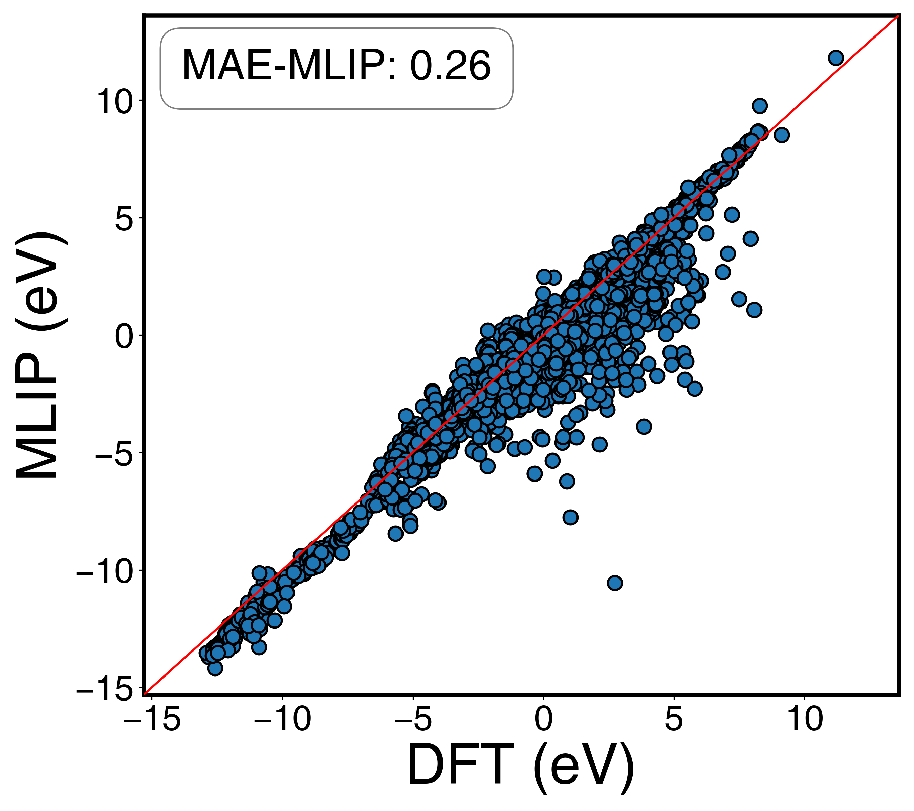

# CatBench

[](https://www.python.org/downloads/)
[](https://opensource.org/licenses/MIT)
[](https://github.com/JinukMoon/CatBench)

**CatBench: Benchmark framework of Machine Learning Interatomic Potentials for Adsorption Energy Predictions in Heterogeneous Catalysis**

CatBench provides a unified framework for evaluating MLIP performance across diverse catalytic systems, offering automated data processing, calculation workflows, and comprehensive analysis tools for adsorption energies, surface energies, bulk formation energies, and equation of state properties.

If you want to use MLIPs in your catalysis research, CatBench enables you to establish quantitative reliability through systematic benchmarking against DFT references.

## Quick Navigation

- [Installation](#installation)
- [Overview](#overview)
- [Adsorption Energy Benchmarking](#adsorption-energy-benchmarking)
- [Relative Energy Benchmarking](#relative-energy-benchmarking)
  - [Surface Energy](#surface-energy)
  - [Bulk Formation Energy](#bulk-formation-energy)
- [Equation of State (EOS) Benchmarking](#equation-of-state-eos-benchmarking)
- [Configuration Options](#configuration-options)
- [Citation](#citation)

## Installation

```bash
# Basic installation (core features only)
pip install catbench

# With D3 dispersion correction support (requires CUDA)
pip install catbench[d3]

# Development installation
git clone https://github.com/JinukMoon/CatBench.git
cd CatBench
pip install -e .

# Development with D3 support
pip install -e .[d3]
```

### Installation Options

- **Basic**: Core benchmarking features without dispersion correction
- **[d3]**: Includes PyTorch for GPU-accelerated D3 dispersion correction

> **Note**: D3 dispersion correction requires CUDA toolkit for GPU acceleration. CPU-only mode is not currently supported.

## Overview


CatBench follows a three-step workflow for comprehensive MLIP evaluation:

1. **Data Processing**: Automated download from CatHub or processing of user VASP calculations
2. **Calculation**: MLIP-based energy calculations with optional D3 dispersion correction
3. **Analysis**: Statistical evaluation, anomaly detection, and visualization

## Adsorption Energy Benchmarking

### Data Preparation

#### Option A: CatHub Database

Download and preprocess catalysis reaction data directly from CatHub:

```python
from catbench.adsorption import cathub_preprocessing

# Single benchmark dataset
cathub_preprocessing("MamunHighT2019")

# Multiple datasets with adsorbate name integration
cathub_preprocessing(
    ["MamunHighT2019", "AraComputational2022"],
    adsorbate_integration={'HO': 'OH', 'O2H': 'OOH'}  # Unify naming conventions
)
```

#### Option B: User VASP Data

> ⚠️ **Important**: The VASP preprocessing functions will DELETE all files except CONTCAR and OSZICAR to save disk space. **Always work with a copy of your original VASP data!**

```bash
# STRONGLY RECOMMENDED: Copy your original data first
cp -r original_vasp_data/ data_for_catbench/
```

Organize your VASP calculation folders following this hierarchy:

```
data_for_catbench/
├── gas/
│   ├── H2gas/            # Complete VASP calculation folder
│   │   ├── INCAR
│   │   ├── POSCAR
│   │   ├── POTCAR
│   │   ├── KPOINTS
│   │   ├── CONTCAR      # Required
│   │   ├── OSZICAR      # Required
│   │   ├── OUTCAR
│   │   ├── vasprun.xml
│   │   └── ...          # All other VASP files
│   └── H2Ogas/
│       ├── CONTCAR
│       ├── OSZICAR
│       └── ...
├── system1/  # e.g., Pt111
│   ├── slab/
│   │   ├── CONTCAR
│   │   ├── OSZICAR
│   │   └── ...
│   ├── H/
│   │   ├── 1/
│   │   │   ├── CONTCAR
│   │   │   ├── OSZICAR
│   │   │   └── ...
│   │   └── 2/
│   │       ├── CONTCAR
│   │       ├── OSZICAR
│   │       └── ...
│   └── OH/
│       ├── 1/
│       │   ├── CONTCAR
│       │   ├── OSZICAR
│       │   └── ...
│       └── 2/
│           ├── CONTCAR
│           ├── OSZICAR
│           └── ...
└── system2/  # e.g., Ni111
    └── ...
```

Process the data with coefficient settings:

```python
from catbench.adsorption import process_output, vasp_preprocessing

# Define reaction stoichiometry
coeff_setting = {
    "H": {
        "slab": -1,      # E(slab)
        "adslab": 1,     # E(H*)
        "H2gas": -1/2,   # -1/2 E(H2)
    },
    "OH": {
        "slab": -1,      
        "adslab": 1,     
        "H2gas": +1/2,   
        "H2Ogas": -1,    
    },
}

# Process and prepare data
process_output("data_for_catbench", coeff_setting)  # Cleans directories, keeps only CONTCAR/OSZICAR
vasp_preprocessing("data_for_catbench")

# Output: Creates raw_data/data_for_catbench_adsorption.json with all processed data
```

After processing:
- All VASP files except CONTCAR and OSZICAR are deleted (saves disk space)
- Data is stored in `raw_data/{dataset_name}_adsorption.json`
- Original folder structure is preserved but cleaned

### Calculation

#### Basic Calculation

```python
from catbench.adsorption import AdsorptionCalculation
from your_mlip import YourCalculator

# Initialize calculators for reproducibility testing
calc_num = 3  # Number of independent calculations
calculators = []
for i in range(calc_num):
    calc = YourCalculator(...)  # Your MLIP with desired settings
    calculators.append(calc)

# Configure and run (only required parameters shown)
config = {
    "mlip_name": "YourMLIP",
    "benchmark": "dataset_name",
}

adsorption_calc = AdsorptionCalculation(calculators, **config)
adsorption_calc.run()
```

#### With D3 Dispersion Correction

```python
from catbench.adsorption import AdsorptionCalculation
from catbench.dispersion import DispersionCorrection
from your_mlip import YourCalculator

# Setup D3 correction (using default PBE parameters)
d3_corr = DispersionCorrection()

# Apply D3 to calculators
calc_num = 3
calculators = []
for i in range(calc_num):
    calc = YourCalculator(...)  # Your MLIP with desired settings
    calc_d3 = d3_corr.apply(calc)  # Combine MLIP with D3
    calculators.append(calc_d3)

# Run calculation
config = {
    "mlip_name": "YourMLIP_D3",
    "benchmark": "dataset_name",
}
adsorption_calc = AdsorptionCalculation(calculators, **config)
adsorption_calc.run()
```

#### OC20 Mode (Direct Adsorption Energy Prediction)

For MLIPs trained on OC20 dataset that directly predict adsorption energies:

```python
from catbench.adsorption import AdsorptionCalculation
from your_oc20_mlip import OC20Calculator  # Your OC20-trained MLIP

# OC20-trained models (directly predict adsorption energies)
calc_num = 3
calculators = []
for i in range(calc_num):
    oc20_calculator = OC20Calculator(...)  # Your OC20 MLIP with desired settings
    calculators.append(oc20_calculator)

# Run in OC20 mode
config = {
    "mlip_name": "OC20_MLIP",
    "benchmark": "dataset_name",
}
adsorption_calc = AdsorptionCalculation(calculators, mode="oc20", **config)
adsorption_calc.run()
```

### Analysis

```python
from catbench.adsorption import AdsorptionAnalysis

# Analyze results (all parameters optional, auto-detects MLIPs)
analysis = AdsorptionAnalysis()
analysis.analysis()
```

This generates:
- **Parity plots**: Visual comparison of MLIP vs DFT energies
- **Excel report**: Comprehensive metrics including MAE, RMSE, anomaly statistics
- **Anomaly detection**: Automatic identification of problematic calculations

You can freely analyze specific adsorbates and MLIPs, and customize various options including parity plot appearance and font sizes through [configuration options](#adsorptionanalysis).

### Threshold Sensitivity Analysis

Evaluate how different threshold values affect anomaly detection:

```python
from catbench.adsorption import AdsorptionAnalysis

analysis = AdsorptionAnalysis()

# Run both threshold sensitivity analyses automatically (default)
analysis.threshold_sensitivity_analysis()

# Or specify a specific mode if needed
analysis.threshold_sensitivity_analysis(mode="disp_thrs")  # Only displacement threshold
analysis.threshold_sensitivity_analysis(mode="bond_length_change_threshold")  # Only bond length threshold
```

This generates stacked area charts showing how anomaly detection rates change with different threshold values, helping you optimize threshold parameters for your specific system. By default, both displacement and bond length threshold analyses are performed automatically.

### Output Files

```
result/
├── YourMLIP/
│   ├── gases/           # Gas molecule calculations
│   ├── log/             # Optimization logs
│   ├── traj/            # Trajectory files
│   ├── YourMLIP_result.json         # All calculation results
│   ├── YourMLIP_gases.json          # Gas energies
│   └── YourMLIP_anomaly_detection.json  # Anomaly flags
└── plot/
    ├── YourMLIP_parity.png           # Parity plots
    └── comparison_all.png            # Multi-MLIP comparison
```

#### 1. Parity Plot Analysis

CatBench generates comprehensive parity plots for visual assessment of MLIP performance:

<div align="center">
<table>
<tr>
<td></td>
<td></td>
</tr>
<tr>
<td align="center"><strong>Mono Plot</strong><br/>All adsorbates combined in single parity plot</td>
<td align="center"><strong>Multi Plot</strong><br/>Separate parity plots for each adsorbate</td>
</tr>
</table>
</div>

#### 2. Comprehensive Excel Analysis

The `{current_directory}_Benchmarking_Analysis.xlsx` file provides detailed performance metrics across multiple sheets:

##### **Main Performance Comparison**
MLIP-to-MLIP performance overview with key metrics (showing 12 benchmarked MLIPs):

| MLIP_name | Normal rate (%) | Anomaly rate (%) | MAE_total (eV) | MAE_normal (eV) | ADwT (%) | AMDwT (%) |
|-----------|----------------|------------------|----------------|-----------------|----------|-----------|
| MLIP_A | 77.25 | 14.39 | 1.118 | 0.316 | 77.98 | 84.71 |
| MLIP_B | 74.22 | 16.84 | 0.667 | 0.512 | 69.66 | 80.80 |
| MLIP_C | 80.18 | 13.51 | 0.917 | 0.241 | 78.97 | 86.79 |
| MLIP_D | 73.20 | 16.26 | 0.738 | 0.413 | 71.27 | 81.03 |
| MLIP_E | 78.45 | 12.87 | 0.892 | 0.298 | 76.15 | 83.92 |
| ... | ... | ... | ... | ... | ... | ... |

*This enables direct performance comparison across all benchmarked MLIPs*

##### **Anomaly Analysis Sheet**
Detailed breakdown of calculation anomalies by category:

| MLIP_name | Normal | Adsorbate Migration | Energy Anomaly | Unphysical Relaxation | Reproduction Failure |
|-----------|--------|-------------------|----------------|----------------------|-------------------|
| MLIP_A | 34,869 | 3,774 | 590 | 3,845 | 2,052 |
| MLIP_B | 33,503 | 4,035 | 834 | 5,221 | 1,537 |
| MLIP_C | 36,178 | 2,847 | 1,334 | 3,671 | 1,100 |
| MLIP_D | 33,025 | 4,759 | 956 | 5,372 | 1,018 |
| ... | ... | ... | ... | ... | ... |

*This helps identify systematic issues and reliability patterns across all MLIPs*

##### **Individual MLIP Sheets** 
Adsorbate-specific performance for each MLIP (example from MLIP_A sheet):

| Adsorbate | Normal_count | Anomaly_count | MAE_normal (eV) | MAE_total (eV) |
|-----------|-------------|---------------|-----------------|----------------|
| H | 1,247 | 89 | 0.234 | 0.891 |
| OH | 1,156 | 124 | 0.298 | 1.045 |
| O | 1,089 | 156 | 0.387 | 1.234 |
| CO | 978 | 203 | 0.445 | 1.567 |
| NH3 | 892 | 167 | 0.512 | 1.789 |
| ... | ... | ... | ... | ... |

*Each of the 12 MLIPs has its own sheet revealing adsorbate-specific strengths and weaknesses*

#### 3. Threshold Sensitivity Analysis

CatBench provides automated threshold sensitivity analysis to optimize anomaly detection parameters:

<div align="center">
<table>
<tr>
<td></td>
<td></td>
</tr>
<tr>
<td align="center"><strong>Displacement Threshold Analysis</strong><br/>Impact of displacement threshold on anomaly detection rates</td>
<td align="center"><strong>Bond Length Threshold Analysis</strong><br/>Impact of bond length change threshold on anomaly detection rates</td>
</tr>
</table>
</div>

*These stacked area charts help optimize threshold parameters for your specific catalytic systems*

#### 4. Additional Analysis Features

- **Timing Analysis**: Computational efficiency metrics and performance scaling
- **Reproducibility Testing**: Multiple calculator runs ensure numerical stability  
- **Statistical Metrics**: MAE, RMSE, R², ADwT, and AMDwT for comprehensive evaluation

## Relative Energy Benchmarking

CatBench supports two main types of relative energy calculations: surface energy and bulk formation energy.

### Surface Energy

#### Data Preparation

> ⚠️ **Important**: Always work with a copy of your VASP data. The preprocessing function will delete all files except CONTCAR and OSZICAR.

```
surface_data/
├── Pt/                    # Material 1
│   ├── bulk/
│   │   ├── CONTCAR
│   │   ├── OSZICAR
│   │   └── ...
│   └── surfaces/
│       ├── 100/
│       │   ├── CONTCAR
│       │   ├── OSZICAR
│       │   └── ...
│       ├── 110/
│       │   ├── CONTCAR
│       │   ├── OSZICAR
│       │   └── ...
│       └── 111/
│           ├── CONTCAR
│           ├── OSZICAR
│           └── ...
├── Ni/                    # Material 2
│   ├── bulk/
│   │   ├── CONTCAR
│   │   ├── OSZICAR
│   │   └── ...
│   └── surfaces/
│       ├── 100/
│       │   ├── CONTCAR
│       │   ├── OSZICAR
│       │   └── ...
│       └── 111/
│           ├── CONTCAR
│           ├── OSZICAR
│           └── ...
└── Cu/                    # Material 3
    ├── bulk/
    │   ├── CONTCAR
    │   ├── OSZICAR
    │   └── ...
    └── surfaces/
        └── 111/
            ├── CONTCAR
            ├── OSZICAR
            └── ...
```

```python
from catbench.relative.surface_energy.data import surface_energy_vasp_preprocessing

# Process surface energy data
surface_energy_vasp_preprocessing("surface_data")
# Output: Creates raw_data/surface_data_surface.json
```

#### Calculation

```python
from catbench.relative import SurfaceEnergyCalculation
from your_mlip import YourCalculator

calc = YourCalculator(...)  # Your MLIP with desired settings

surface_calc = SurfaceEnergyCalculation(
    calculator=calc,
    mlip_name="YourMLIP",
    benchmark="surface_benchmark"
)
surface_calc.run()
```

#### Analysis

```python
from catbench.relative import RelativeEnergyAnalysis

# Analyze surface energy results
analysis = RelativeEnergyAnalysis(
    task_type="surface",  # Required: "surface", "bulk_formation", or "custom"
    benchmark="surface_benchmark"
)
analysis.analysis()
```

#### Output Files

```
result/
├── YourMLIP/
│   ├── YourMLIP_surface_benchmark.json  # Calculation results
│   └── YourMLIP_surface_benchmark.xlsx  # Excel report
└── plot/
    └── YourMLIP/
        ├── surface_parity.png           # Parity plot
        └── surface_comparison.png        # Multi-MLIP comparison
```

### Bulk Formation Energy

#### Data Preparation

```
formation_data/
├── bulk_compounds/
│   ├── NiO/
│   │   ├── CONTCAR
│   │   └── OSZICAR
│   └── Fe2O3/
│       ├── CONTCAR
│       └── OSZICAR
└── elements/
    ├── Ni/
    │   ├── CONTCAR
    │   └── OSZICAR
    ├── Fe/
    │   ├── CONTCAR
    │   └── OSZICAR
    └── O/
        ├── CONTCAR
        └── OSZICAR
```

```python
from catbench.relative.bulk_formation.data import vasp_preprocessing

# Define formation reaction stoichiometry
coeff_setting = {
    "NiO": {
        "bulk": 1,      # NiO
        "Ni": -1,       # -Ni
        "O": -1/2,      # -1/2 O2
    },
    "Fe2O3": {
        "bulk": 1,      # Fe2O3
        "Fe": -2,       # -2Fe
        "O": -3/2,      # -3/2 O2
    },
}

vasp_preprocessing("formation_data", coeff_setting)
```

#### Calculation

```python
from catbench.relative import BulkFormationCalculation
from your_mlip import YourCalculator

calc = YourCalculator(...)  # Your MLIP with desired settings

formation_calc = BulkFormationCalculation(
    calculator=calc,
    mlip_name="YourMLIP",
    benchmark="formation_benchmark"
)
formation_calc.run()
```

#### Analysis

```python
from catbench.relative import RelativeEnergyAnalysis

# Analyze bulk formation energy results
analysis = RelativeEnergyAnalysis(
    task_type="bulk_formation",
    benchmark="formation_benchmark"
)
analysis.analysis()
```

#### Output Files

```
result/
├── YourMLIP/
│   ├── YourMLIP_formation_benchmark.json  # Calculation results
│   └── YourMLIP_formation_benchmark.xlsx  # Excel report
└── plot/
    └── YourMLIP/
        ├── formation_parity.png           # Parity plot
        └── formation_comparison.png        # Multi-MLIP comparison
```

## Equation of State (EOS) Benchmarking

### Data Preparation

> ⚠️ **Important**: Always work with a copy of your VASP data. The preprocessing function will delete all files except CONTCAR and OSZICAR.

EOS data requires multiple volume points for each material:

```
eos_data/
├── Pt/                    # Material 1
│   ├── 0/                 # Volume point 0 (smallest)
│   │   ├── CONTCAR
│   │   └── OSZICAR
│   ├── 1/
│   │   ├── CONTCAR
│   │   └── OSZICAR
│   ├── ...
│   └── 10/                # Volume point 10 (largest)
│       ├── CONTCAR
│       └── OSZICAR
├── Ni/                    # Material 2
│   ├── 0/
│   │   ├── CONTCAR
│   │   └── OSZICAR
│   ├── 1/
│   │   ├── CONTCAR
│   │   └── OSZICAR
│   └── ...
└── Cu/                    # Material 3
    ├── 0/
    │   ├── CONTCAR
    │   └── OSZICAR
    └── ...
```

Each material folder contains subdirectories (0, 1, 2, ..., 10) representing different volume points for EOS fitting.

```python
from catbench.eos import eos_vasp_preprocessing

eos_vasp_preprocessing("eos_data")
# Output: Creates raw_data/eos_data_eos.json
```

### Calculation

```python
from catbench.eos import EOSCalculation
from your_mlip import YourCalculator

calc = YourCalculator(...)  # Your MLIP with desired settings

eos_calc = EOSCalculation(
    calculator=calc,
    mlip_name="YourMLIP",
    benchmark="eos_benchmark"
)
eos_calc.run()
```

### Analysis

```python
from catbench.eos import EOSAnalysis

# Analyze results (auto-detects MLIPs if not specified)
eos_analysis = EOSAnalysis()
eos_analysis.analysis()
```

This provides:
- **Bulk modulus comparison**: MLIP vs DFT
- **Equilibrium volume accuracy**
- **EOS curve fitting quality**

### Output Files

```
result/
├── YourMLIP/
│   └── YourMLIP_eos_benchmark.json     # Calculation results
└── plot/
    └── YourMLIP/
        ├── Pt_eos.png                   # Individual material EOS curves
        ├── Ni_eos.png
        ├── Cu_eos.png
        └── eos_comparison.png           # Multi-MLIP comparison
```

The Excel report includes:
- **Summary**: Bulk modulus and equilibrium volume metrics
- **Material Details**: Per-material performance
- **EOS Parameters**: Fitted curve parameters
- **Raw Data**: Complete E-V data points

## Configuration Options

### AdsorptionCalculation

| Parameter | Description | Type | Default |
|-----------|-------------|------|---------|
| `mlip_name` | Name identifier for the MLIP | str | Required |
| `benchmark` | Dataset name or "multiple_tag" for combined | str | Required |
| `mode` | Calculation mode: "basic" or "oc20" | str | "basic" |
| `f_crit_relax` | Force convergence criterion (eV/Å) | float | 0.05 |
| `n_crit_relax` | Maximum optimization steps | int | 999 |
| `rate` | Fraction of atoms to fix (0: use original) | float | 0.5 |
| `damping` | Optimization damping factor | float | 1.0 |
| `optimizer` | ASE optimizer: "LBFGS", "BFGS", "FIRE" | str | "LBFGS" |
| `save_step` | Save interval for checkpointing | int | 50 |

### AdsorptionAnalysis

| Parameter | Description | Type | Default |
|-----------|-------------|------|---------|
| `calculating_path` | Path to results directory | str | "./result" |
| `mlip_list` | MLIPs to analyze | list[str] | Auto-detect |
| `target_adsorbates` | Specific adsorbates to analyze | list[str] | All |
| `exclude_adsorbates` | Adsorbates to exclude | list[str] | None |
| `benchmarking_name` | Output file prefix | str | Current dir |
| `disp_thrs` | Displacement threshold (Å) | float | 0.5 |
| `energy_thrs` | Energy anomaly threshold (eV) | float | 2.0 |
| `reproduction_thrs` | Reproducibility threshold (eV) | float | 0.2 |
| `bond_length_change_threshold` | Bond length change threshold (fraction) | float | 0.2 |
| `energy_cutoff` | Max reference energy to include (eV) | float | None |
| `time_unit` | Time display unit: "s", "ms", "µs" | str | "s" |
| `chemical_bond_cutoff` | Chemical bond cutoff distance (Å) | float | 6.0 |
| **Plot Appearance** | | | |
| `figsize` | Plot dimensions | tuple[int, int] | (9, 8) |
| `dpi` | Plot resolution | int | 300 |
| `mark_size` | Marker size in plots | int | 100 |
| `linewidths` | Line width in plots | float | 1.5 |
| `specific_color` | Color for monochrome plots | str | "#2077B5" |
| **Plot Axes** | | | |
| `min` | Minimum value for plot axes | float | None |
| `max` | Maximum value for plot axes | float | None |
| `x_tick_bins` | Number of x-axis tick bins | int | 5 |
| `y_tick_bins` | Number of y-axis tick bins | int | 5 |
| `tick_decimal_places` | Decimal places for tick labels | int | 1 |
| `tick_labelsize` | Font size for tick labels | int | 25 |
| **Font Sizes** | | | |
| `xlabel_fontsize` | Font size for x-axis labels | int | 40 |
| `ylabel_fontsize` | Font size for y-axis labels | int | 40 |
| `mae_text_fontsize` | Font size for MAE text | int | 30 |
| `legend_fontsize` | Legend font size | int | 25 |
| `comparison_legend_fontsize` | Comparison plot legend font size | int | 15 |
| **Display Options** | | | |
| `legend_off` | Hide legends in plots | bool | False |
| `mae_text_off` | Hide MAE text in plots | bool | False |
| `error_bar_display` | Show error bars in plots | bool | False |
| `xlabel_off` | Hide x-axis labels | bool | False |
| `ylabel_off` | Hide y-axis labels | bool | False |
| `grid` | Show grid on plots | bool | False |
| `plot_enabled` | Generate plots | bool | True |
| **Advanced** | | | |
| `font_setting` | Custom font settings [family, path] | list[str] | False |
| `mlip_name_map` | Dictionary for MLIP display names | dict[str, str] | {} |

### DispersionCorrection

| Parameter | Description | Type | Default |
|-----------|-------------|------|---------|
| `damping_type` | Damping function: "damp_bj", "damp_zero" | str | "damp_bj" |
| `functional_name` | DFT functional for parameters | str | "pbe" |
| `vdw_cutoff` | van der Waals cutoff (au²) | int | 9000 |
| `cn_cutoff` | Coordination number cutoff (au²) | int | 1600 |

### SurfaceEnergyCalculation / BulkFormationCalculation

| Parameter | Description | Type | Default |
|-----------|-------------|------|---------|
| `calculator` | ASE calculator instance | ASE Calculator | Required |
| `mlip_name` | MLIP identifier | Required |
| `benchmark` | Dataset name | Required |
| `f_crit_relax` | Force convergence (eV/Å) | 0.05 |
| `n_crit_relax` | Max steps | 999 |

### RelativeEnergyAnalysis

| Parameter | Description | Type | Default |
|-----------|-------------|------|---------|
| `calculating_path` | Path to results directory | str | "./result" |
| `plot_path` | Path for plot output | str | "./plot" |
| `benchmark` | Dataset name | str | Current dir name |
| `task_type` | Analysis type: "surface", "bulk_formation", "custom" | str | Required |
| `mlip_list` | MLIPs to analyze | list[str] | Auto-detect |
| `figsize` | Plot dimensions | tuple[int, int] | (9, 8) |
| `dpi` | Plot resolution | int | 300 |
| `mark_size` | Marker size in plots | int | 100 |
| `linewidths` | Line width in plots | float | 1.5 |
| `specific_color` | Color for plots | str | "#2077B5" |
| `min` | Minimum value for plot axes | float | None |
| `max` | Maximum value for plot axes | float | None |
| `font_setting` | Custom font settings | list[str] | False |

### EOSCalculation

| Parameter | Description | Type | Default |
|-----------|-------------|------|---------|
| `calculator` | ASE calculator instance | ASE Calculator | Required |
| `mlip_name` | MLIP identifier | Required |
| `benchmark` | Dataset name | Required |

### EOSAnalysis

| Parameter | Description | Type | Default |
|-----------|-------------|------|---------|
| `calculating_path` | Path to results directory | str | "./result" |
| `plot_path` | Path for plot output | str | "./plot" |
| `benchmark` | Dataset name | str | Current dir name |
| `mlip_list` | MLIPs to analyze | list[str] | Auto-detect |
| `figsize` | Plot dimensions | tuple[int, int] | (9, 8) |
| `dpi` | Plot resolution | int | 300 |
| `mark_size` | Marker size in plots | int | 100 |
| `x_tick_bins` | Number of x-axis tick bins | int | 5 |
| `y_tick_bins` | Number of y-axis tick bins | int | 5 |
| `tick_decimal_places` | Decimal places for tick labels | int | 1 |
| `tick_labelsize` | Font size for tick labels | int | 25 |
| `xlabel_fontsize` | Font size for x-axis labels | int | 40 |
| `ylabel_fontsize` | Font size for y-axis labels | int | 40 |
| `legend_fontsize` | Legend font size | int | 25 |
| `comparison_legend_fontsize` | Comparison plot legend font size | int | 15 |
| `grid` | Show grid on plots | bool | False |
| `font_setting` | Custom font settings | list[str] | False |

## Citation

If you use CatBench in your research, please cite:

```bibtex
@article{catbench2025,
  title={CatBench: Benchmark Framework of Machine Learning Interatomic Potentials for Adsorption Energy Predictions in Heterogeneous Catalysis},
  author={Moon, Jinuk and Jeon, Uchan and Choung, Seokhyun and Han, Jeong Woo},
  journal={Cell Reports Physical Science},
  year={2025},
  note={In revision}
}
```

## License

This project is licensed under the MIT License - see the [LICENSE](LICENSE) file for details.

## Contact

**Jinuk Moon** - [jumoon@snu.ac.kr](mailto:jumoon@snu.ac.kr)  
Seoul National University

---

For bug reports, feature requests, and contributions, visit our [GitHub repository](https://github.com/JinukMoon/CatBench).